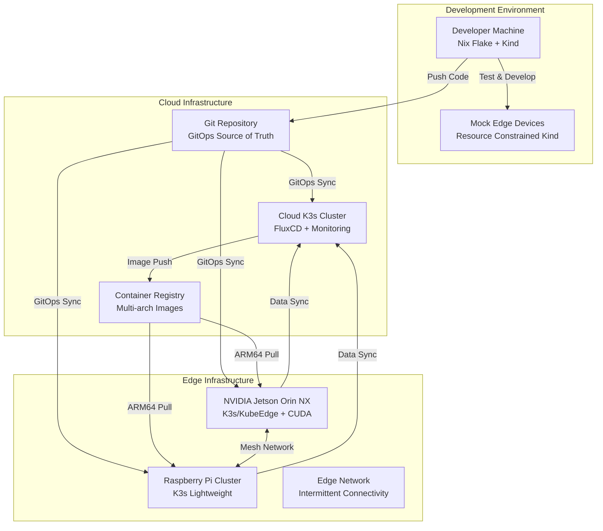

# Edge Computing Architecture

## 🎯 System Overview



## 🏗️ Component Architecture

### Development Layer
```
Nix Flake Environment
├── Core Tools (kubectl, flux, ansible, helm)
├── Container Tools (docker, podman, buildx)
├── Edge Tools (qemu, cross-compile, device simulators)
├── Development Clusters (Kind with edge simulation)
└── CI/CD Tools (multi-arch builds, testing)
```

### GitOps Layer
```
Git Repository Structure
├── clusters/
│   ├── dev/              # Development cluster configs
│   ├── cloud/            # Cloud production configs  
│   ├── edge-jetson/      # Jetson-specific configs
│   └── edge-pi/          # Raspberry Pi configs
├── apps/
│   ├── base/             # Base application manifests
│   ├── cloud/            # Cloud-specific overlays
│   └── edge/             # Edge-specific overlays
├── infrastructure/
│   ├── monitoring/       # Observability stack
│   ├── networking/       # Service mesh, ingress
│   └── storage/          # Persistent volumes, databases
└── bootstrap/
    ├── ansible/          # Device provisioning playbooks
    └── flux/             # FluxCD bootstrap configs
```

### Edge Computing Layer

#### NVIDIA Jetson Orin NX (Primary Edge Compute)
```yaml
# Jetson Capabilities
Hardware:
  CPU: 8-core ARM Cortex-A78AE @ 2.2GHz
  GPU: 1024-core NVIDIA Ampere GPU
  Memory: 64GB LPDDR5
  Storage: NVMe SSD
  Connectivity: Gigabit Ethernet, WiFi 6, 5G (optional)

Software Stack:
  OS: Ubuntu 20.04 ARM64 (JetPack SDK)
  Container Runtime: containerd with NVIDIA Container Runtime
  Kubernetes: K3s with NVIDIA Device Plugin
  Edge Platform: KubeEdge (for advanced scenarios) or K3s (for simplicity)
  AI/ML: CUDA 11.4+, TensorRT, PyTorch, ONNX Runtime

Workload Types:
  - AI/ML Inference (GPU-accelerated)
  - Video Processing (hardware-accelerated)
  - Edge Data Processing
  - Local Caching and Aggregation
  - Real-time Analytics
```

#### Raspberry Pi 4/5 (Lightweight Edge)
```yaml
# Raspberry Pi Capabilities  
Hardware:
  CPU: 4-core ARM Cortex-A72 @ 1.8GHz (Pi 4) / A76 @ 2.4GHz (Pi 5)
  Memory: 8GB LPDDR4
  Storage: MicroSD + USB SSD
  Connectivity: Gigabit Ethernet, WiFi, Bluetooth

Software Stack:
  OS: Ubuntu Server 22.04 ARM64
  Container Runtime: containerd
  Kubernetes: K3s (lightweight)
  Edge Platform: K3s only (resource constraints)

Workload Types:
  - Sensor Data Collection
  - Simple Web Services
  - Local Storage and Sync
  - Protocol Translation (Modbus, MQTT, etc.)
  - Simple Analytics and Filtering
```

## 🔄 Deployment Patterns

### Pattern 1: Cloud-First with Edge Sync
```yaml
# Use Case: Web application with edge caching
Flow:
  1. Develop and test in local Kind cluster
  2. Deploy to cloud K3s cluster via GitOps
  3. Sync cacheable content to edge devices
  4. Edge devices serve cached content locally
  5. Periodic sync back to cloud for updates

Example Applications:
  - Content delivery networks
  - Distributed caching
  - Offline-capable web apps
```

### Pattern 2: Edge-First with Cloud Aggregation
```yaml
# Use Case: IoT data collection and processing
Flow:
  1. Edge devices collect and process data locally
  2. Local AI/ML inference on Jetson for real-time decisions
  3. Processed data aggregated and sent to cloud
  4. Cloud provides global analytics and model updates
  5. Updated models deployed back to edge via GitOps

Example Applications:
  - Industrial IoT monitoring
  - Computer vision at the edge
  - Predictive maintenance
```

### Pattern 3: Hybrid Cloud-Edge Workloads
```yaml
# Use Case: Distributed application across cloud and edge
Flow:
  1. Application components deployed to both cloud and edge
  2. Edge components handle local processing and user interaction
  3. Cloud components handle heavy computation and data storage
  4. Service mesh provides secure communication
  5. Data synchronization and consistency management

Example Applications:
  - Distributed databases
  - Edge AI with cloud training
  - Hybrid rendering (edge preprocessing + cloud processing)
```

## 🛡️ Security Architecture

### Network Security
```yaml
Security Layers:
  - VPN Mesh: WireGuard between cloud and edge
  - mTLS: Service-to-service authentication
  - Network Policies: Kubernetes network segmentation
  - Firewall: Edge device protection
  - Certificate Management: cert-manager for TLS automation

Edge-Specific Considerations:
  - Offline certificate validation
  - Local credential storage and rotation
  - Secure boot and attestation (Jetson)
  - Physical security measures
```

### Data Security
```yaml
Encryption:
  - At Rest: LUKS encryption on edge devices
  - In Transit: TLS 1.3 for all communications
  - In Processing: Confidential computing where possible

Access Control:
  - RBAC: Kubernetes role-based access control
  - Device Identity: Unique device certificates
  - Zero Trust: Verify every connection
  - Audit Logging: Comprehensive security logging
```

## 📊 Monitoring and Observability

### Metrics Architecture
```yaml
Prometheus Stack:
  - Cloud: Full Prometheus + Grafana + AlertManager
  - Edge: Prometheus Agent mode with remote write
  - Metrics: Hardware, Kubernetes, Application metrics
  - Alerts: Proactive monitoring and alerting

Edge-Specific Metrics:
  - GPU utilization (Jetson)
  - Temperature and power consumption
  - Network connectivity status
  - Local storage usage
  - AI/ML inference performance
```

### Logging Architecture
```yaml
Logging Stack:
  - Cloud: ELK/EFK stack for centralized logging
  - Edge: Fluent Bit with local buffering
  - Log Shipping: Batch upload when connected
  - Local Storage: Rotation and compression

Edge Considerations:
  - Offline log retention
  - Bandwidth-aware log shipping
  - Local log analysis and alerting
  - Structured logging for machine parsing
```

### Tracing Architecture
```yaml
Distributed Tracing:
  - Jaeger for distributed tracing
  - OpenTelemetry for instrumentation
  - Edge trace collection and forwarding
  - Cross-cluster trace correlation

Challenges:
  - Intermittent connectivity handling
  - Local trace storage and forwarding
  - Performance impact on resource-constrained devices
```

## 🔧 Resource Management

### Jetson Resource Allocation
```yaml
Resource Management:
  CPU: 
    - Reserve 2 cores for system
    - 6 cores available for workloads
  GPU:
    - NVIDIA Device Plugin for GPU sharing
    - GPU memory isolation between workloads
    - CUDA Multi-Process Service (MPS) for efficiency
  Memory:
    - Reserve 8GB for system and GPU
    - 56GB available for applications
    - Memory limits and requests properly set

Power Management:
  - Power mode optimization (MAX_N vs efficiency)
  - Dynamic voltage and frequency scaling
  - Thermal throttling awareness
  - UPS/battery backup integration
```

### Raspberry Pi Resource Allocation
```yaml
Resource Management:
  CPU:
    - Reserve 1 core for system
    - 3 cores for lightweight workloads
  Memory:
    - Reserve 2GB for system
    - 6GB for applications
    - Swap configuration for burst loads
  Storage:
    - Root on SD card (read-optimized)
    - Data on USB SSD
    - Log rotation and cleanup automation

Optimization:
  - Minimal OS installation
  - Disabled unnecessary services
  - CPU governor tuning
  - I/O scheduler optimization
```

## 🚀 Scaling Strategies

### Horizontal Scaling
```yaml
Edge Device Scaling:
  - Add more Pi devices for lightweight workloads
  - Add more Jetson devices for compute-intensive tasks
  - Load balancing across edge devices
  - Geographic distribution of edge nodes

Application Scaling:
  - Kubernetes HPA for reactive scaling
  - Predictive scaling based on historical data
  - Edge-cloud workload migration
  - Resource pooling across devices
```

### Vertical Scaling
```yaml
Resource Optimization:
  - Right-sizing container requests/limits
  - GPU sharing and time-slicing
  - Memory optimization techniques
  - Storage tier optimization

Performance Tuning:
  - CUDA optimization for AI workloads
  - Container image optimization for ARM64
  - Network optimization for edge scenarios
  - Caching strategies for improved performance
```

This architecture provides a foundation for building robust, scalable edge computing solutions while maintaining development simplicity and operational excellence.