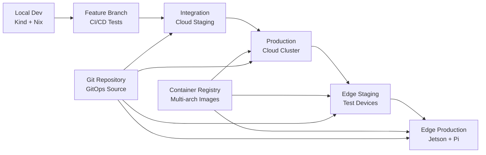

# Cloud-to-Edge Deployment Pipeline

## 🎯 Pipeline Overview

Our deployment pipeline supports progressive delivery from local development to edge devices, with strong emphasis on reproducibility, testing, and automated rollback capabilities.



## 🏗️ Pipeline Stages

### Stage 1: Local Development
**Environment**: Developer machine with Nix flake

```yaml
Purpose: Rapid iteration and initial testing
Tools:
  - Kind clusters for local K8s testing
  - Mock edge devices (resource-constrained Kind nodes)
  - ARM64 emulation via QEMU
  - Local container registry for testing

Quality Gates:
  - Unit tests pass
  - Local integration tests pass
  - ARM64 builds succeed
  - Security scans pass (container images)
  
Artifacts:
  - Multi-arch container images (AMD64, ARM64)
  - Kubernetes manifests
  - Helm charts (if applicable)
  - Test results and coverage reports
```

### Stage 2: Continuous Integration
**Environment**: GitHub Actions / GitLab CI / Jenkins

```yaml
Triggers:
  - Pull request creation
  - Push to feature branches
  - Scheduled nightly builds

Build Matrix:
  Architectures: [amd64, arm64]
  Platforms: [linux/amd64, linux/arm64]
  Targets: [cloud, edge-jetson, edge-pi]

Jobs:
  1. Code Quality:
     - Lint (Go, Python, YAML, Dockerfile)
     - Security scan (Trivy, Snyk)
     - License compliance check
     
  2. Build & Test:
     - Multi-arch container builds
     - Unit tests on AMD64
     - Cross-compilation tests for ARM64
     - Helm chart validation
     
  3. Integration Tests:
     - Deploy to ephemeral Kind cluster
     - Run integration test suite
     - Test ARM64 functionality in QEMU
     - Performance benchmarks
     
  4. Security & Compliance:
     - Container image vulnerability scan
     - Kubernetes manifest security scan
     - Compliance checks (PCI, HIPAA if needed)

Quality Gates:
  - All tests pass
  - Code coverage > 80%
  - No high/critical security vulnerabilities
  - Performance benchmarks within thresholds
```

### Stage 3: Cloud Staging
**Environment**: Cloud K3s cluster (staging)

```yaml
Purpose: Integration testing in cloud-like environment
Deployment Method: FluxCD GitOps automatic sync

Test Types:
  - End-to-end functional tests
  - Load testing
  - Chaos engineering tests
  - Database migration tests
  - Cross-service integration tests

Monitoring:
  - Application metrics (Prometheus)
  - Distributed tracing (Jaeger)
  - Log aggregation (ELK/EFK)
  - SLA monitoring

Quality Gates:
  - All E2E tests pass
  - Performance SLAs met
  - No error rate increase
  - Successful chaos engineering tests
  
Duration: 2-4 hours automated testing
Manual Gates: Product owner approval for production
```

### Stage 4: Cloud Production
**Environment**: Cloud K3s cluster (production)

```yaml
Deployment Strategy: Blue/Green or Canary
Rollout Method: FluxCD with manual approval gates

Blue/Green Deployment:
  1. Deploy to blue environment
  2. Run smoke tests
  3. Switch traffic to blue
  4. Monitor for issues
  5. Keep green for rollback

Canary Deployment:
  1. Deploy to 5% of traffic
  2. Monitor key metrics
  3. Gradually increase to 25%, 50%, 100%
  4. Automated rollback on metric degradation

Monitoring:
  - Real-time error rates
  - Response time percentiles
  - Business metrics
  - Customer satisfaction scores

Quality Gates:
  - Error rate < 0.1%
  - P95 response time < SLA
  - No customer complaints
  - Business metrics stable

Rollback Triggers:
  - Error rate > 1%
  - Response time > 2x SLA
  - Manual rollback request
  - Critical security issue
```

### Stage 5: Edge Staging
**Environment**: Test Jetson Orin + Raspberry Pi

```yaml
Purpose: Validate edge-specific functionality
Test Devices:
  - 1x Jetson Orin NX (production hardware)
  - 2x Raspberry Pi 4/5 (cluster testing)
  - Simulated network conditions

Edge-Specific Tests:
  - Offline operation testing
  - Intermittent connectivity handling
  - Resource constraint validation
  - GPU workload testing (Jetson)
  - Power consumption monitoring
  - Temperature stress testing

Test Scenarios:
  - Network disconnection for 1, 5, 30 minutes
  - High CPU/GPU load testing
  - Storage space exhaustion recovery
  - Memory pressure testing
  - Container restart resilience

Quality Gates:
  - Offline operation successful
  - Resource limits respected
  - GPU acceleration working
  - Recovery from failures
  - Performance within targets

Duration: 24-48 hours (includes offline testing)
```

### Stage 6: Edge Production
**Environment**: Production Jetson Orin + Raspberry Pi fleet

```yaml
Deployment Strategy: Rolling update with health checks
Rollout Method: FluxCD with edge-specific configurations

Rolling Update Process:
  1. Update one device at a time
  2. Health check after each update
  3. Wait for stability before next device
  4. Automatic rollback on failure

Health Checks:
  - Application readiness probes
  - GPU functionality (Jetson)
  - Network connectivity
  - Resource utilization
  - Business logic validation

Monitoring:
  - Device health metrics
  - Application performance
  - Network connectivity status
  - GPU utilization
  - Storage and memory usage

Rollback Strategy:
  - Automatic: Health check failures
  - Manual: Operations team trigger
  - Emergency: Critical security patches

Post-Deployment:
  - 24-hour monitoring period
  - Gradual traffic increase
  - Performance baseline updates
```

## 🔧 Infrastructure as Code

### Ansible Playbooks
```yaml
Device Provisioning:
  - jetson-setup.yml: CUDA, K3s, monitoring setup
  - pi-setup.yml: Lightweight K3s, basic monitoring
  - networking.yml: VPN, firewall, connectivity
  - monitoring.yml: Prometheus agent, log shipping

Deployment Automation:
  - k3s-cluster.yml: K3s installation and configuration
  - flux-bootstrap.yml: FluxCD installation and Git sync
  - app-deploy.yml: Application-specific deployment
  - rollback.yml: Emergency rollback procedures

Maintenance:
  - update-system.yml: OS and security updates
  - backup.yml: Configuration and data backup
  - health-check.yml: Comprehensive system validation
```

### FluxCD Configuration
```yaml
Repository Structure:
  clusters/
    ├── cloud-staging/
    ├── cloud-production/
    ├── edge-staging/
    └── edge-production/
      ├── jetson/
      └── raspberry-pi/

Sync Strategy:
  Cloud: Automatic sync every 1 minute
  Edge Staging: Automatic sync every 5 minutes
  Edge Production: Manual promotion after validation

Kustomizations:
  - Base manifests for all environments
  - Environment-specific overlays
  - Device-specific configurations
  - Resource constraints per device type
```

## 📊 Monitoring and Observability

### Metrics Collection
```yaml
Cloud Metrics:
  - Application performance (Prometheus)
  - Infrastructure metrics (Node Exporter)
  - Business metrics (custom exporters)
  - Cost metrics (cloud provider APIs)

Edge Metrics:
  - Device health (temperature, power, connectivity)
  - Application performance (lightweight metrics)
  - Resource utilization (CPU, memory, GPU, storage)
  - Network quality (latency, bandwidth, packet loss)

Alerting:
  - PagerDuty for critical production issues
  - Slack for warnings and information
  - Email for scheduled reports
  - SMS for emergency situations
```

### Log Management
```yaml
Cloud Logs:
  - Centralized logging (ELK/EFK stack)
  - Real-time log analysis
  - Long-term log retention
  - Compliance logging

Edge Logs:
  - Local log collection (Fluent Bit)
  - Intelligent log shipping (bandwidth aware)
  - Local log retention for offline analysis
  - Emergency log extraction procedures

Log Analysis:
  - Error pattern detection
  - Performance trend analysis
  - Security event correlation
  - Capacity planning insights
```

## 🚨 Incident Response

### Automated Response
```yaml
Cloud Incidents:
  - Automatic scaling on high load
  - Circuit breaker activation
  - Automatic rollback on deployment issues
  - Failover to backup regions

Edge Incidents:
  - Local failover between edge devices
  - Graceful degradation of services
  - Offline mode activation
  - Alert escalation to operations team

Recovery Procedures:
  - Database restore from backups
  - Configuration rollback via Git
  - Emergency deployment bypassing pipeline
  - Network connectivity restoration
```

### Manual Response
```yaml
Incident Severity Levels:
  P1 (Critical): Complete service outage
    - Response time: 15 minutes
    - Escalation: Immediate to on-call engineer
    
  P2 (High): Partial service degradation
    - Response time: 1 hour
    - Escalation: Standard on-call rotation
    
  P3 (Medium): Performance issues
    - Response time: 4 hours
    - Escalation: Business hours support
    
  P4 (Low): Minor issues
    - Response time: 24 hours
    - Escalation: Next business day

Communication:
  - Status page updates
  - Customer notifications
  - Internal team alerts
  - Post-incident reports
```

## 🔄 Continuous Improvement

### Pipeline Optimization
```yaml
Performance Metrics:
  - Deployment frequency
  - Lead time for changes
  - Mean time to recovery
  - Change failure rate

Automation Goals:
  - Reduce manual intervention
  - Increase deployment confidence
  - Faster feedback loops
  - Better test coverage

Regular Reviews:
  - Weekly pipeline performance review
  - Monthly architecture review
  - Quarterly technology evaluation
  - Annual disaster recovery testing
```

This deployment pipeline ensures reliable, automated delivery of applications from development to edge devices while maintaining high quality standards and rapid recovery capabilities.